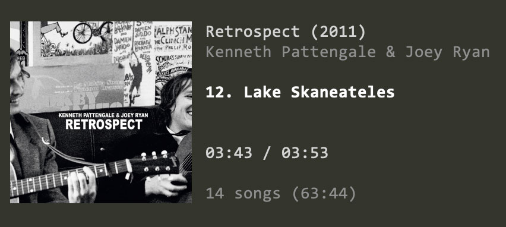

# Moose Player  

> A simplistic console music player

## Features

* Very simple interface
* Focus on your albums
* Search your music database via [lunr](https://lunrjs.com)
* Displays cover art (works best on [iTerm2](https://www.iterm2.com))
* Supports most audio formats (e.g. MP3, OGG, MP4, M4A, FLAC, WAV, AAC)
* Backed by [ffmpeg](http://ffmpeg.org)/[libav](https://libav.org) and [SDL](https://www.libsdl.org)
* Gapless playback

## Installing/Building

    git clone https://github.com/michel-kraemer/moose-player.git
    cd moose-player
    yarn

Requires `libavformat`, `libswresample` and `libsdl2` to be present on your
system.

## Usage

First index your music collection:

    node lib/reindex.js "~/My Music"

This has only be done once or whenever your music collection has changed.

Then run the player with a [lunr](https://lunrjs.com) query to select an album to play:

    node lib/index.js "+Kenneth +Retrospect"

Press <kbd>q</kbd> to exit.

## Keys

<kbd>q</kbd>  
&emsp;Quit application

<kbd>Space</kbd>  
&emsp;Pause/resume playback

<kbd>n</kbd> *or* <kbd>&darr;</kbd>  
&emsp;Play next song

<kbd>p</kbd> *or* <kbd>&uarr;</kbd>  
&emsp;Play previous song

<kbd>0</kbd> &hellip; <kbd>9</kbd>  
&emsp;Jump to the track with the entered number

Used libraries
--------------

Moose Player uses the following libraries by dynamically linking to them:

* [Libav](https://libav.org) and [Libswresample](https://www.ffmpeg.org/libswresample.html)
  licensed under the [LGPLv2.1](https://www.gnu.org/licenses/old-licenses/lgpl-2.1.html)
* [SDL 2.0](https://www.libsdl.org) distributed under the
  [zlib license](https://www.zlib.net/zlib_license.html)

License
-------

Moose Player is licensed under the
[Apache License, Version 2.0](http://www.apache.org/licenses/LICENSE-2.0).

Unless required by applicable law or agreed to in writing, software
distributed under the License is distributed on an "AS IS" BASIS,
WITHOUT WARRANTIES OR CONDITIONS OF ANY KIND, either express or implied.
See the License for the specific language governing permissions and
limitations under the License.
